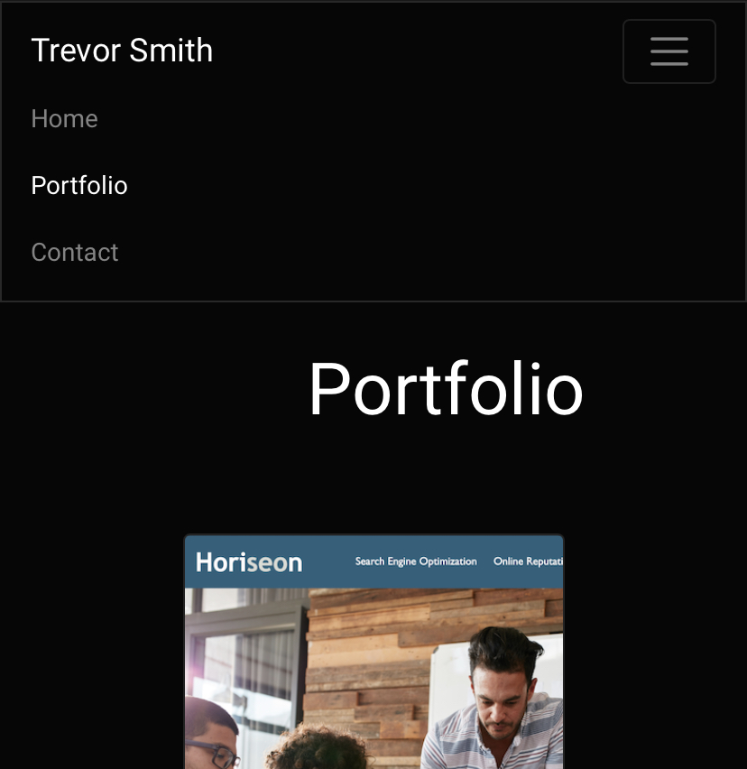
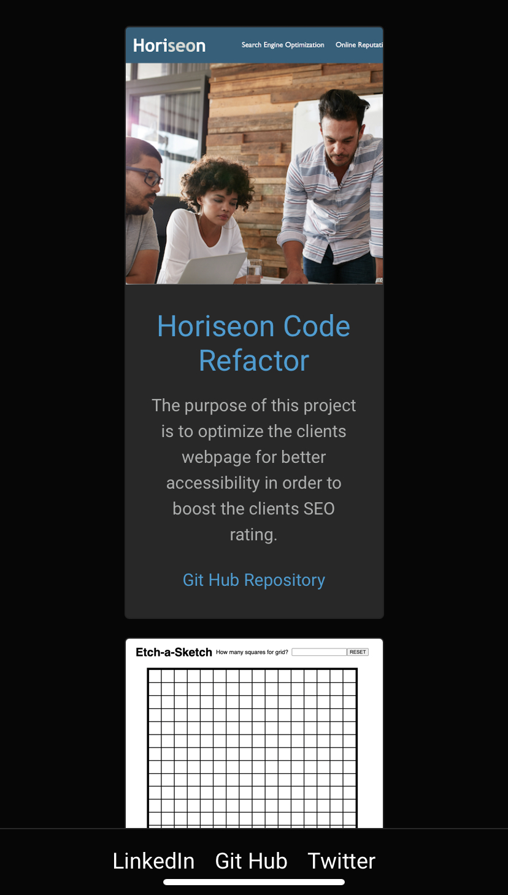

# My Portfolio

## Description

In this project I will be building a website that will function as my portfolio. This website will utilize bootstrap in order to make a responsive website that is compatible with many device from small screens to large ones. It will included a _Home_ page, a _Portfolio_ page and a _Contact_ page.

## Features

#### Navbar

* Each page features this responsive navbar to navigate through pages.   

   

* On a mobile device the navebar collapses to improve functionality.   

   

* The website also includes a sticky footer at the bottom of each page that includes links to various social media pages.  

   

* The use of bootstrap components like ` 
` results in responsive layouts that scale between various screen sizes. Below is an example of the card-group class on an iPhone. Notice the sticky footer is always visible as well.  

  

## Deployed Link

[https://trevorsmithbanjo.github.io/](https://trevorsmithbanjo.github.io/)